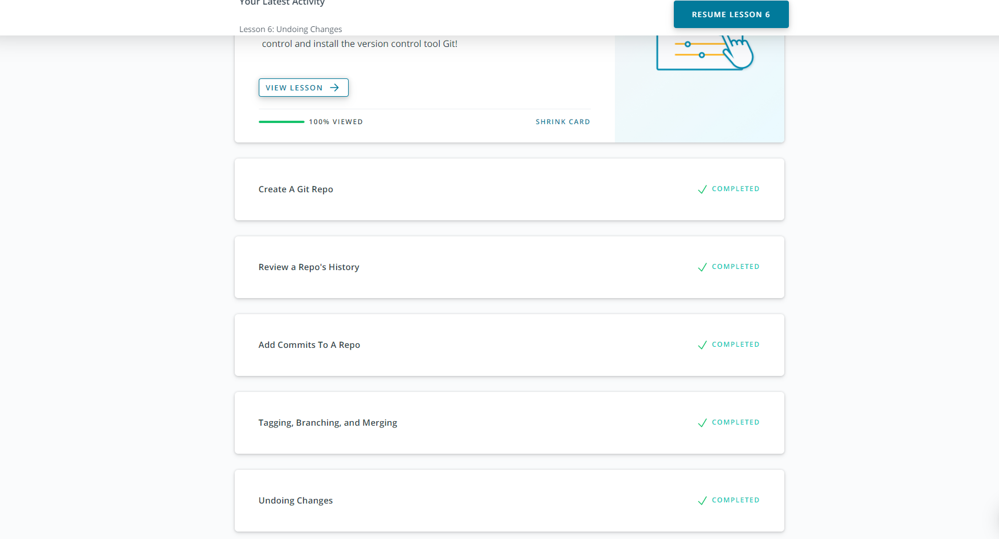
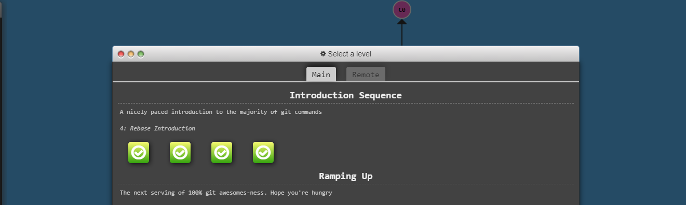
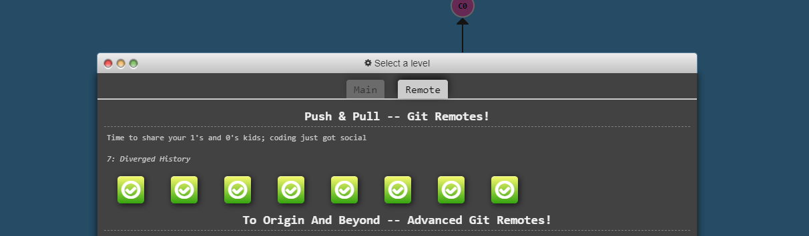

# Kottans-Frontend
---
## Stage 0. Self-Study

### Tasks Listing
---
#### Git & Linux CLI, HTT
- [x] Git intro
- [ ] Linux CLI, HTTP
- [ ] Git for Team Collaboration
---
#### HTML & CSS
- [ ] Front-End Basics
- [ ] Responsive Layouts
- [ ] HTML & CSS Practice - practice
#### JavaScript
- [ ] JavaScript Basics
- [ ] Document Object Model - practice
- [ ] Building a Tiny JS World (pre-OOP) - practice
- [ ] Object-Oriented JavaScript - practice
#### Exercises
- [ ] OOP exercise - practice
- [ ] Offline Web Applications - optional
- [ ] Memory – Pair Game - practice
- [ ] Website Performance Optimization - optional
- [ ] Friends App - practice
---

# My Progress
## Stage 0. Self-Study

#### Git & Linux CLI, HTT
1. Git intro

