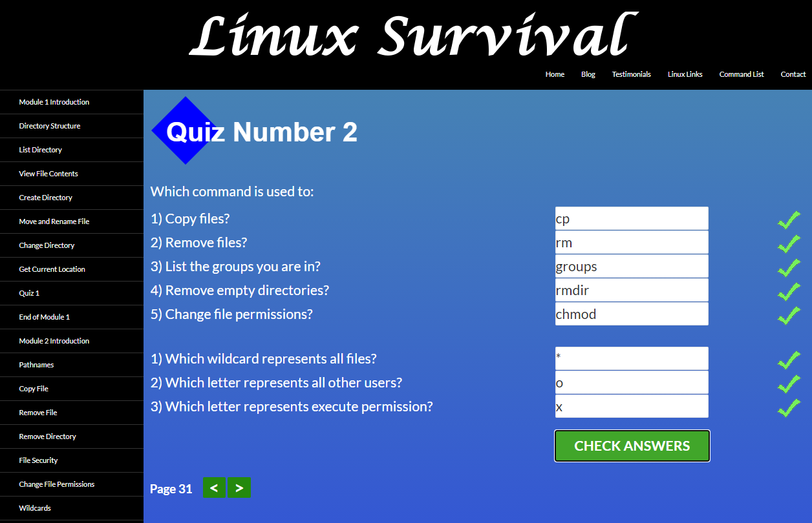

# Kottans-Frontend
---
## Stage 0. Self-Study

### Tasks Listing
---
#### General
- [x] Git Basics
- [x] Linux CLI and Networking
- [x] VCS (hello gitty), GitHub and Collaboration
---
#### Front-End Basics
- [ ] Intro to HTML & CSS
- [ ] Responsive Layouts
- [ ] HTML & CSS Practice - practice
- [ ] JavaScript Basics
- [ ] Document Object Model - practice
---
#### Advanced Topics
- [ ] Building a Tiny JS World (pre-OOP) - practice
- [ ] Object-Oriented JavaScript - practice
- [ ] OOP exercise - practice
- [ ] Offline Web Applications - optional
- [ ] Memory – Pair Game - practice
- [ ] Website Performance Optimization - optional
- [ ] Friends App - practice
---

# My Progress

## Git Basics

A lot of new information & commands. Until this moment not often use a git(. Now I understand how much I lost

Greate visualization of work with branch. Formalization Readme.txt

I will use GIT)

## Linux CLI, and HTTP

Terminal commands like a magic spells)

New commands: more, chmod, rmdir, groups, finger, lp, ps, grep, kill,df

Will use all of them

## Git Collaboration

Good explanation about remote, about works with others. Information about contribute was interesting, I`ve never look it this file before.

REBASE) before use only merge. Git cherry-pick - absolutely mew command

Will use - git pull source:destination; all about rebase

## Main Materials

---
## Extra Materials
* [Git за 30 хвилин](https://codeguida.com/post/453)

* [Git tips — consolidate your knowledge of Git](https://codeguida.com/post/453)

* [About Merge Conflicts](https://www.webfx.com/blog/web-design/git-tips/)

* [Resoilving a Merge Conflict](https://docs.github.com/en/free-pro-team@latest/github/collaborating-with-issues-and-pull-requests/about-merge-conflicts)

* [Communicating using Markdown](https://lab.github.com/githubtraining/communicating-using-markdown)

* [TypingClub](https://www.typingclub.com/) — improve your typing speed

* [Как учиться и справляться с негативными мыслями](https://guides.hexlet.io/learning/)
---
* [Основы командной строки Hexlet (РУС)](https://ru.hexlet.io/courses/cli-basics)

* [HTTP: Протокол, який повинен розуміти кожний веб-розробник (Частина 1) (УКР)](https://code.tutsplus.com/uk/tutorials/http-the-protocol-every-web-developer-must-know-part-1--net-31177)

* [HTTP: Протокол, який повинен розуміти кожний веб-розробник (Частина 2)](https://code.tutsplus.com/uk/tutorials/http-the-protocol-every-web-developer-must-know-part-2--net-31155)

---
## Optional
* [Configuring Linux Web Servers](https://www.udacity.com/course/configuring-linux-web-servers--ud299)

* [Networking for Web Developers](https://www.udacity.com/course/networking-for-web-developers--ud256)